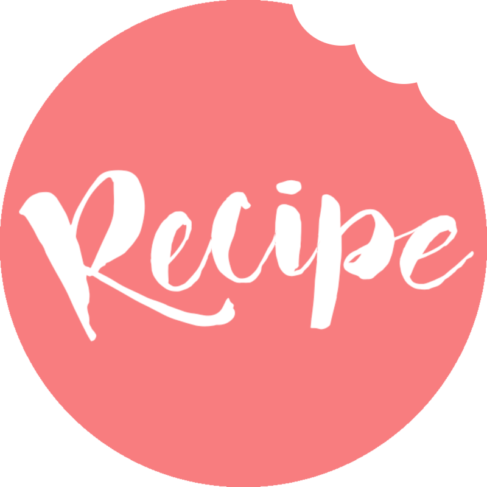

<a name="readme-top"></a>

<div align="center">

  <h1><b>Recipe App  | Ruby on Rails Capstone Project</b></h1>
</div>


<!-- TABLE OF CONTENTS -->

# 📗 Table of Contents

- [📖 About the Project](#about-project)
  - [🛠 Built With](#built-with)
    - [Tech Stack](#tech-stack)
    - [Key Features](#key-features)
    <!-- - [🚀 Live Demo](#live-demo) -->
- [💻 Getting Started](#getting-started)
  - [Setup](#setup)
  - [Prerequisites](#prerequisites)
  - [Install](#install)
  - [Usage](#usage)
  - [Run tests](#run-tests)
  - [Deployment](#triangular_flag_on_post-deployment)
- [👥 Authors](#authors)
- [🔭 Future Features](#future-features)
- [🤝 Contributing](#contributing)
- [⭐️ Show your support](#support)
- [🙏 Acknowledgements](#acknowledgements)
- [📝 License](#license)

---

<!-- PROJECT DESCRIPTION -->

#  Recipe app <a name="about-project"></a>

**"Recipe app"** keeps track of all your recipes, ingredients, and inventory. It will allow you to save ingredients, keep track of what you have, create recipes, and generate a shopping list based on what you have and what you are missing from a recipe. Also, since sharing recipes is an important part of cooking the app should allow you to make them public so anyone can access them.

These is the ERD for the project:
 


---

## 🛠 Built With <a name="built-with"></a>

### Tech Stack

The project is built using the following technologies:

* Ruby on Rails.
* PostgreSQL.
* RSpec.
* Rubocop.
* Stylelint.

<br>

---

<!-- Features -->

### Key Features <a name="key-features"></a>

- [x] Create and delete recipes and ingredients.
- [x] 'Make public' option to share recipes with other users.
- [x] User authentication.
- [x] Responsive design.

Please note: Each feature will be marked with an "x" when it is fully implemented and operational.

<ul>
  <li>HTML & CSS3</li>
  <li>Ruby on Rails</li>
  <li>Linters
    <ul>
      <li>Rubocop</li>
      <li>StyleLint</li>
    </ul>
  </li>
  <li>Follow Microverse's list of best practices</li>
</ul>

<p align="right">(<a href="#readme-top">back to top</a>)</p>

---

<!-- 
## 🚀 Live Demo <a name="live-demo"></a>
<!--
- 🎤 [Project presentation: video demo](https://drive.google.com/file/d/1-eSDabquIJCbvbQblqBPvSwbDIvaRfIb/view?usp=sharing)
- [Live Demo Link](https://space-travelers-hub-jxxr.onrender.com)

-->

<p align="right">(<a href="#readme-top">back to top</a>)</p>


<!-- GETTING STARTED -->

## 💻 Getting Started <a name="getting-started"></a>

To get a local copy up and running, follow these steps.

### Prerequisites
In order to run this project you need to have:

- Installed Ruby and Ruby on Rails.
- If you're using Windows, have installed WSL.
- If you're using MacOS, an option is using UTM.

### Setup
To clone this repository to your desired folder, run the following command: <br>

```
git clone https://github.com/grauJavier/recipe-app.git
```

Navigate to the cloned repository and run the following command to install the necessary gems:
```
cd blog-app
bundle install
```

<p align="right">(<a href="#readme-top">back to top</a>)</p>

### Usage
Initialize it with
```
rails server
```
Then open `http://localhost:3000` in your browser.

<p align="right">(<a href="#readme-top">back to top</a>)</p>

### Test
To run the tests try the following command:
```
rspec spec
```

<p align="right">(<a href="#readme-top">back to top</a>)</p>

<p align="right">(<a href="#readme-top">back to top</a>)</p>

---

<!-- AUTHORS -->

## 👥 Authors <a name="authors"></a>

👤 **Javier Grau**
- GitHub: [@grauJavier](https://github.com/grauJavier)
- Twitter: [@jgrauchile](https://twitter.com/jgrauchile)
- LinkedIn: [LinkedIn](https://www.linkedin.com/in/javiergrau)

👤 **Ruth Abreu**

- GitHub: [@Ruthmy](https://github.com/Ruthmy)
- Twitter: [@rury_exe](https://twitter.com/rury_exe)
- LinkedIn: [LinkedIn](https://linkedin.com/in/ruth-abreu)

<p align="right">(<a href="#readme-top">back to top</a>)</p>

---

<!-- FUTURE FEATURES -->

## 🔭 Future Features <a name="future-features"></a>

Upcoming improvements:

- [ ] Search functionality for locating specific articles.
- [ ] User profiles with customizable avatars.

<p align="right">(<a href="#readme-top">back to top</a>)</p>

---

<!-- CONTRIBUTING -->

## 🤝 Contributing <a name="contributing"></a>

Contributions, issues, and feature requests are welcome!

Feel free to check the [issues page](https://github.com/grauJavier/recipe-app/issues).

<p align="right">(<a href="#readme-top">back to top</a>)</p>

---

<!-- SUPPORT -->

## ⭐️ Show your support <a name="support"></a>

If you like this project and know someone who might find it helpful, please share it.
Or give it a **star** ⭐️

<p align="right">(<a href="#readme-top">back to top</a>)</p>

---

<!-- ACKNOWLEDGEMENTS -->

## 🙏 Acknowledgments <a name="acknowledgements"></a>

I thank Microverse for this fantastic opportunity, and the code reviewers for their advice and time.

<p align="right">(<a href="#readme-top">back to top</a>)</p>

---

<!-- LICENSE -->

## 📝 License <a name="license"></a>

This project is [MIT](./LICENSE) licensed.

<p align="right">(<a href="#readme-top">back to top</a>)</p>

---
